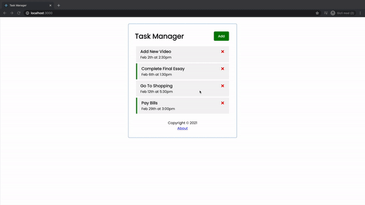

# Getting Started with Create React App

This project was bootstrapped with [Create React App](https://github.com/facebook/create-react-app).

# Sample Test Video

[Try It Out Now!](https://static-task-manager-react.netlify.app/)

<a href="https://static-task-manager-react.netlify.app/"></a>


## Available Scripts Usage

### Install dependencies

```
npm install
```

### Run React dev server (http://localhost:3000)

```
npm start
```

### Run the JSON server (http://localhost:5000)

```
npm run server
```

### To build for production

```
npm run build
```
